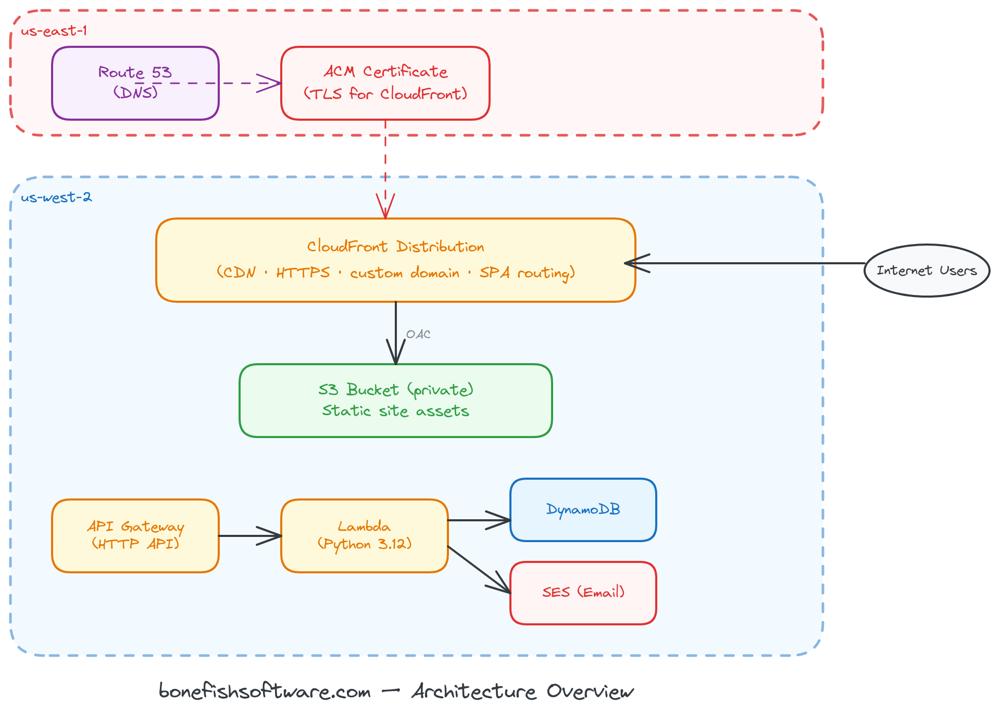
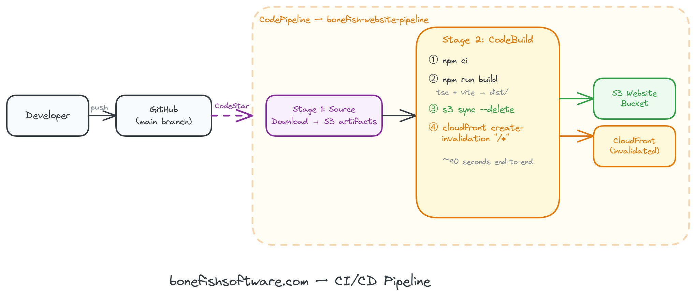

# Building a Production Company Website on AWS — Project Overview

**Series:** Building bonefishsoftware.com from scratch  
**Author:** Josh Blair  
**Live site:** https://bonefishsoftware.com

---

## What We Built

This series documents the end-to-end process of designing, building, and deploying a production company website for a software and cloud consulting business. The result is a modern, fully serverless stack with automated CI/CD deployments — built intentionally to demonstrate and practice the AWS services I use professionally.

**Tech stack at a glance:**

| Layer | Technology |
|---|---|
| Frontend | React 18 + Vite + TypeScript + Tailwind CSS v4 |
| Hosting | Amazon S3 + CloudFront (CDN) |
| DNS & TLS | Route 53 + ACM (SSL/TLS certificate) |
| CI/CD | GitHub + AWS CodePipeline + CodeBuild |
| Contact API | API Gateway (HTTP) + AWS Lambda (Python) |
| Data storage | Amazon DynamoDB |
| Email delivery | Amazon SES |
| IaC | AWS CloudFormation + AWS SAM |

---

## Architecture Overview



---

## CI/CD Pipeline

Every push to the `main` branch on GitHub automatically triggers a full build and deploy:



---

## Articles in This Series

| # | Article | What it covers |
|---|---|---|
| 1 | **Project Overview** *(this article)* | Full architecture, stack decisions, what we're building |
| 2 | [React + Vite + Tailwind Setup](02-react-vite-tailwind.md) | Scaffolding the SPA, routing, design system, component structure |
| 3 | [Static Site Hosting on AWS](03-aws-static-hosting.md) | S3, CloudFront with OAC, ACM, Route 53 DNS, CloudFormation |
| 4 | [CI/CD with CodePipeline & CodeBuild](04-cicd-codepipeline.md) | GitHub connection, pipeline stages, buildspec.yml, IAM roles |
| 5 | [Serverless Contact Form](05-serverless-contact-form.md) | Lambda, API Gateway, DynamoDB, SES, CORS, SAM deployment |

---

## Key Design Decisions

### Why React + Vite (not Next.js)?
Next.js is a great framework, but for a static marketing site, it's overhead. Vite produces a clean static build (`dist/`) that S3 + CloudFront serves perfectly. The site has no server-side rendering requirements. Vite also gives faster local dev iteration.

### Why S3 + CloudFront (not Amplify or Vercel)?
This project is intentionally built on "raw" AWS primitives — CodePipeline, CloudFormation, S3, CloudFront — rather than abstracted platforms. The goal is to learn and demonstrate AWS services used in real enterprise projects.

### Why CloudFormation (not CDK or Terraform)?
CloudFormation is the AWS-native tool that every AWS practitioner encounters. Understanding it directly — before abstracting to CDK — builds a stronger mental model of what's actually being deployed.

### Why separate ACM cert in us-east-1?
CloudFront is a global service and requires ACM certificates to be provisioned specifically in `us-east-1`, regardless of where your other resources live. This is an AWS constraint, not a design choice.

### Why CloudFront OAC (not OAI)?
Origin Access Control (OAC) is the modern replacement for Origin Access Identity (OAI). It supports all S3 operations, works with SSE-KMS encrypted buckets, and uses AWS SigV4 signing.

---

## Repository Structure

```
bonefishsoftware.com/
├── src/                    # React source
│   ├── components/         # Navbar, Footer, SectionHeader
│   ├── pages/              # Home, Services, Technologies, Portfolio, Team, Contact
│   └── data/               # services.ts, technologies.ts, team.ts
├── public/                 # Static assets (logo, sitemap, robots.txt)
├── lambda/
│   └── contact/            # Python Lambda — contact form handler
├── infra/
│   ├── acm/                # certificate.yml (deploy to us-east-1)
│   └── stacks/
│       ├── website.yml     # S3 + CloudFront (deploy to us-west-2)
│       ├── pipeline.yml    # CodePipeline + CodeBuild (deploy to us-west-2)
│       └── contact-api.yml # SAM — API Gateway + Lambda + DynamoDB (deploy to us-west-2)
├── docs/                   # This documentation
├── buildspec.yml           # CodeBuild build spec
└── index.html              # Vite entry point with SEO meta tags
```
